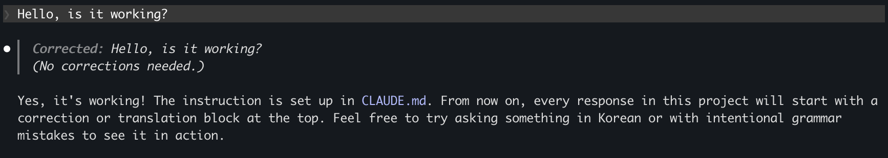
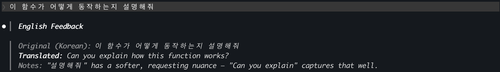
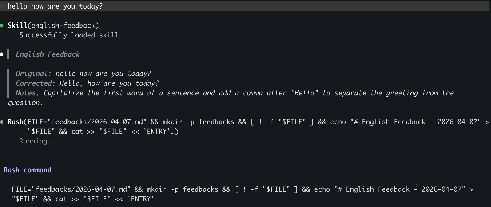
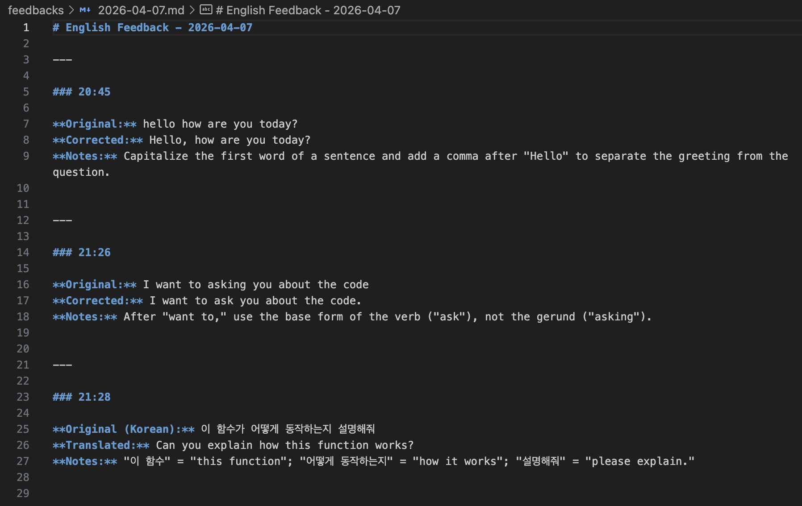
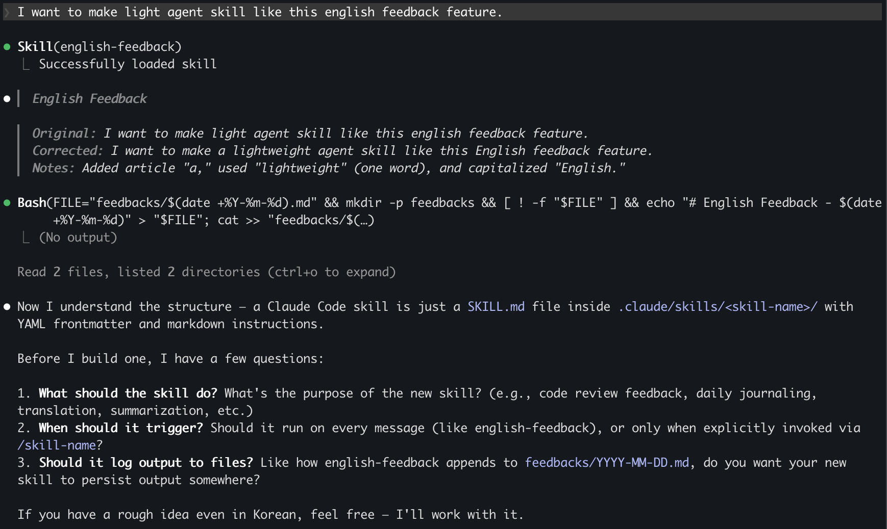

## 도입: 문제 인식

개발자로 일하다 보면 영어로 커뮤니케이션할 일이 많다. 코드 리뷰, 이슈 작성, 문서화, 그리고 글로벌 팀과의 협업까지. 그런데 매번 영어 문장을 쓸 때마다 "이게 자연스러운 표현인가?" 하는 의문이 든다.

영어 공부를 따로 할 시간은 없고, 그렇다고 매번 번역기를 돌리기엔 실력이 늘지 않는다. **일하면서 자연스럽게 영어 피드백을 받을 수 있는 방법**은 없을까?

그래서 생각한 방법이 이거다 — Claude Code에 영어 교정 스킬을 직접 만들어서, 내가 뭘 물어보든 **매번 영어 피드백을 먼저 받고**, 그 피드백이 자동으로 쌓이게 만드는 것.

---

## 1단계: CLAUDE.md로 빠르게 프로토타이핑

처음부터 복잡하게 시작하지 않았다. 프로젝트 루트에 `CLAUDE.md` 파일 하나를 만들고, 간단한 지시를 넣었다.

```markdown
# English Output Training

Every response MUST start with a correction/translation block before answering:

- **If the user writes in English:** Correct grammar, word choice, and naturalness.
- **If the user writes in Korean:** Translate the question into natural English.

Format:
> **Corrected/Translated:** [sentence here]

Then answer the question below.
```

`CLAUDE.md`는 Claude Code가 해당 프로젝트에서 작업할 때 자동으로 읽는 설정 파일이다. 여기에 적어두면 매 응답에 해당 지시가 반영된다.

테스트해봤다.

**영어로 질문:**
```
> Hello, is it working?
```

**Claude의 응답:**
```
> **Corrected:** Hello, is it working?
> (No corrections needed.)

Yes, it's working! ...
```



**한국어로 질문:**
```
> 이 함수가 어떻게 동작하는지 설명해줘
```

**Claude의 응답:**
```
> ...
> **Translated:** Can you explain how this function works?
> ...
```



잘 동작한다. 그런데 여기서 욕심이 생겼다. **교정 받은 내용을 자동으로 기록해서 나중에 복습할 수 있으면 좋겠다.**

---

## 2단계: 스킬로 격상시키기

`CLAUDE.md`만으로는 한계가 있다. 교정 내용을 파일에 자동 저장하려면, Claude Code의 **스킬(Skill)** 시스템을 활용해야 한다.

### 스킬이란?

Claude Code 스킬은 `.claude/skills/<skill-name>/SKILL.md` 경로에 마크다운 파일로 정의한다. YAML frontmatter에 메타데이터를 넣고, 본문에 동작 지시를 작성하면 된다.

스킬에는 두 가지 타입이 있다:
- **Model-invoked**: Claude가 자동으로 판단해서 실행
- **User-invoked**: `/skill-name` 슬래시 커맨드로 수동 실행

영어 피드백은 매 응답마다 자동으로 동작해야 하니까 model-invoked로 만들었다.

### 프로젝트 구조

```
english-feedbacks/
├── CLAUDE.md                            # 간소화된 프로젝트 설명
├── .claude/
│   └── skills/
│       └── english-feedback/
│           └── SKILL.md                 # 스킬 정의
└── feedbacks/                           # 일별 피드백 파일 (자동 생성)
    └── 2026-04-07.md
```

### SKILL.md 작성

스킬의 핵심은 세 단계로 구성했다.

**1단계 — 언어 감지 & 피드백 생성**

```markdown
## Step 1: Detect Language and Generate Feedback

Examine the user's message:

- **English input**: Correct grammar, word choice, phrasing, or naturalness.
- **Korean input**: Translate the full message into natural, idiomatic English.
- **Mixed input**: Translate Korean portions and correct English portions.
```

**2단계 — 피드백 블록 표시**

응답 최상단에 blockquote로 교정 결과를 보여준다.

```markdown
> **English Feedback**
>
> **Original:** I want to asking you about the code
> **Corrected:** I want to ask you about the code
> **Notes:** "want to" is followed by the base form of the verb.
```

**3단계 — 일별 파일에 자동 기록**

여기가 핵심이다. 스킬이 Bash를 이용해 `feedbacks/YYYY-MM-DD.md` 파일에 교정 내용을 자동으로 append한다.

```bash
FILE="feedbacks/$(date +%Y-%m-%d).md"
mkdir -p feedbacks
[ ! -f "$FILE" ] && echo "# English Feedback - $(date +%Y-%m-%d)" > "$FILE"
```



그리고 매 교정마다 시간과 함께 기록:

```markdown
# English Feedback - 2026-04-07

---
### 20:45
**Original:** hello how are you today?
**Corrected:** Hello, how are you today?
**Notes:** Capitalize the first word of a sentence and add a comma after "Hello" to separate the greeting from the question.

---
### 21:26
**Original:** I want to asking you about the code
**Corrected:** I want to ask you about the code.
**Notes:** After "want to," use the base form of the verb ("ask"), not the gerund ("asking").

---
### 21:28
**Original (Korean):** 이 함수가 어떻게 동작하는지 설명해줘
**Translated:** Can you explain how this function works?
**Notes:** "이 함수" = "this function"; "어떻게 동작하는지" = "how it works"; "설명해줘" = "please explain."
```

하루가 끝나면 그날의 교정 내용을 한눈에 볼 수 있다.



---

## 3단계: 디테일 다듬기

처음 만든 버전에서 몇 가지를 보완했다.

### "교정에 머무르지 않기" 규칙 추가

영어 피드백은 좋은데, 매번 교정 설명이 길어지면 본래 작업이 지연된다. 그래서 규칙을 추가했다:

```markdown
- After the feedback block, proceed with the actual task immediately.
  Do not linger on the correction.
```

교정은 간결하게, 그리고 바로 실제 업무로 넘어간다.

### "모호하면 물어보기" 규칙

```markdown
- When the user's prompt is ambiguous, ask clarifying questions
  before proceeding rather than guessing.
```

영어 연습이 목적이지, 잘못된 추측으로 작업이 엉뚱한 방향으로 가면 안 되니까.

---

## 결과: 어떻게 쓰이는가

이제 이 레포에서 Claude Code를 열고 아무 말이나 하면 된다.

**영어로 질문 (문법 오류 포함):**
```
I want to make light agent skill like this english feedback feature.
```

**Claude의 응답:**
```
> **English Feedback**
>
> **Original:** I want to make light agent skill like this english feedback feature.
> **Corrected:** I want to make a lightweight agent skill like this English feedback feature.
> **Notes:** Added article "a"; "light" → "lightweight" is more natural for software;
>   "english" should be capitalized.

Sure, let's plan that out...
```



그리고 `feedbacks/2026-04-07.md`를 열어보면 이 교정이 자동으로 기록되어 있다.

**한국어로 질문:**
```
프롬프트 관련해서 아래와 같은 내용 반영해줄 수 있나요?
```

**Claude의 응답:**
```
> **English Feedback**
>
> **Original (Korean):** 프롬프트 관련해서 아래와 같은 내용 반영해줄 수 있나요?
> **Translated:** Could you apply the following changes regarding the prompt?
> **Notes:** "reflect" works but "apply" sounds more natural in this context.

Sure, let me update...
```

---

## 다음 단계: 글로벌 확장

현재는 이 프로젝트에서만 동작한다. 모든 프로젝트에서 영어 피드백을 받고 싶다면:

1. `.claude/skills/english-feedback/`를 `~/.claude/skills/english-feedback/`로 이동
2. 피드백 저장 경로를 상대 경로에서 절대 경로로 변경 (`~/english-feedbacks/feedbacks/`)
3. 어떤 프로젝트에서 작업하든 영어 피드백이 자동으로 따라온다

---

## 마무리: 개발 환경 자체가 영어 학습 환경

이 스킬의 핵심 아이디어는 단순하다. **따로 시간을 내서 영어를 공부하는 게 아니라, 일하는 과정 자체에 영어 피드백을 녹여넣는 것.**

- 매번 교정 받으니까 같은 실수를 반복하지 않게 된다
- 일별 파일로 쌓이니까 나중에 복습할 수 있다
- 한국어로 질문해도 영어 번역이 따라오니까 "이렇게 말하면 되는구나" 하고 자연스럽게 익힌다

Claude Code의 스킬 시스템은 이런 식으로 **개발 워크플로우에 자연스럽게 녹아드는 도구**를 만들기에 딱 좋다. 복잡한 설정 없이 마크다운 파일 하나로 시작할 수 있다는 점이 가장 큰 장점이다.
