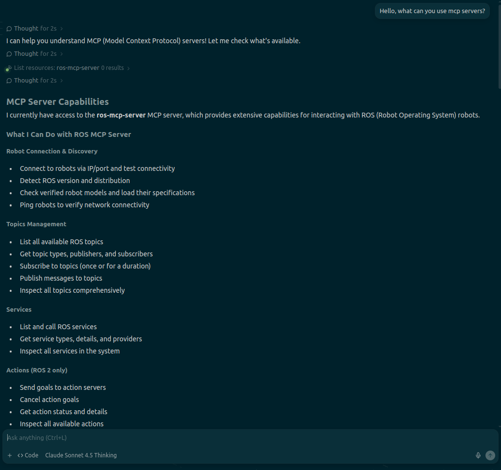

## 1. 들어가며

최근 화제가 되고 있는 **MCP(Model Context Protocol)** 를 로봇 개발 환경에 적용해 보았습니다. 단순히 코드를 작성해 주는 Copilot을 넘어, IDE(Windsurf)가 로컬의 ROS 2 시스템에 직접 접속하여 토픽을 조회하고, 카메라 데이터를 읽어 분석하는 과정을 실습한 기록을 공유합니다.

## 2. 개발 환경 구성

실습은 다음 환경에서 진행되었습니다.

- **OS:** Ubuntu 22.04 LTS
- **ROS Version:** ROS 2 Humble
- **IDE:** Windsurf (MCP 지원)
- **H/W:** Intel RealSense D435 (또는 유사 모델)

### 2.1 ros-mcp-server 설치 및 실행

먼저 로컬 ROS 환경과 LLM을 연결해 줄 `ros-mcp-server`를 세팅합니다. 자세한 설치 방법은 [설치 공식 문서](https://github.com/robotmcp/ros-mcp-server/blob/main/docs/installation.md)를 참고해 주세요.

> **Note:** MCP 서버가 ROS와 통신하기 위해서는 WebSocket 기반의 `rosbridge`가 필요합니다. Windsurf 설정을 하기 전에, 터미널에서 아래 명령어로 브릿지 서버를 먼저 실행합니다.

```bash
# rosbridge_server가 없다면 설치: sudo apt install ros-humble-rosbridge-server
ros2 launch rosbridge_server rosbridge_websocket_launch.xml
```


### 2.2 Windsurf 설정 (mcp_config.json)

Windsurf가 로컬의 MCP 서버를 인식할 수 있도록 `mcp_config.json`을 설정합니다.

```json
// mcp_config.json 예시
{
  "mcpServers": {
    "ros-mcp": {
      "command": "bash",
      "args": [
        "-lc",
        "uvx ros-mcp --transport=stdio"
      ]
    }
  }
}
```


설정을 저장하고 Windsurf를 재시작합니다. Cascade(Chat) 창에 **"사용 가능한 MCP 도구가 있어?"** 라고 물어보면, `ros-mcp-server`가 연동되었음을 확인해 주고 사용할 수 있는 기능들을 나열해 줍니다.



## 3. 실습: RealSense 카메라 데이터 분석

이제 Windsurf의 Cascade(Chat) 기능을 통해 실제 로봇 데이터에 접근해 보겠습니다.

### 3.1 ROS 2 시스템 연결 및 토픽 조회

먼저 별도의 터미널에서 RealSense 노드를 실행합니다.

```bash
ros2 launch realsense2_camera rs_launch.py camera_namespace:='/' align_depth.enable:=true rgb_camera.color_profile:=640x360x30
```


노드가 실행된 상태에서 Windsurf에게 ROS 시스템 상태를 물어봅니다.

**[Prompt]**

> "ok, please check enable ros2 topics and services"

**[Result]**

> 127.0.0.1:9090에 성공적으로 연결되었으며, 현재 실행 중인 RealSense 관련 토픽들이 리스팅되었습니다.
>
> - `/camera/color/image_raw`
> - `/camera/depth/image_rect_raw`
> - ... (총 14개 토픽, 47개 서비스 감지)


### 3.2 이미지 데이터 읽기 및 상황 분석 (Multimodal)

이번 실습의 핵심입니다. 단순히 토픽 리스트를 보는 것을 넘어, **AI에게 카메라 토픽을 직접 구독(Subscribe)하고 카메라 이미지의 상황을 설명해달라고 요청**했습니다.

**[Prompt]**

> "can you subscribe '/camera/color/image_raw' topic and specify what image is?"

**[Result]**

Windsurf(MCP)가 해당 토픽의 이미지를 캡처하여 분석한 결과는 다음과 같습니다.

> **Image Analysis:**
> 
> - **해상도:** 640x360 (RGB8)
> - **상황 묘사:** 책상/작업 공간의 1인칭 시점
> - **주요 객체:** 남색 셔츠 혹은 스웨터를 입은 사람, 검은색 원형 물체(렌즈 캡 등으로 추정)를 들고 있는 손 (?)
> - **배경:** 하얀 벽, 창문, 사무실 장비들

살짝 틀리긴 했지만 실제로 카메라 앞에 **동그란 검정 마이크**가 있었는데, 모델은 이를 '렌즈 캡'이나 유사한 '검은 원형 물체'로 추정했습니다. 완벽하진 않지만, **이미지 토픽을 구독하여 물체의 형태와 색상, 작업자의 자세를 텍스트로 묘사**해 냈다는 점이 인상적입니다.


실행된 MCP Tool의 상세 로그를 열어보면, 실제로 `subscribe_once` 함수가 호출되고 이미지가 분석된 과정을 확인할 수 있습니다.


(실제 카메라 토픽 이미지)

## 4. 마치며

이번 실습을 통해 `ros-mcp-server`를 활용하면 **LLM이 로봇의 '눈(Sensor)'을 공유하고, 실제 데이터 흐름에 개입할 수 있음**을 확인했습니다.

아직은 VLM(Vision-Language Model)을 로봇 엣지 디바이스에 직접 올리기 무거운 경우가 많습니다. 하지만 우선 이렇게 외부 서버의 LLM을 활용한다면, **"앞에 장애물이 있어?"** 와 같은 자연어 질문만으로 로봇의 상태를 디버깅하거나, 상황을 인지하여 다음 액션을 결정하는 지능형 워크플로우 구현이 가능해질 것으로 기대됩니다.

